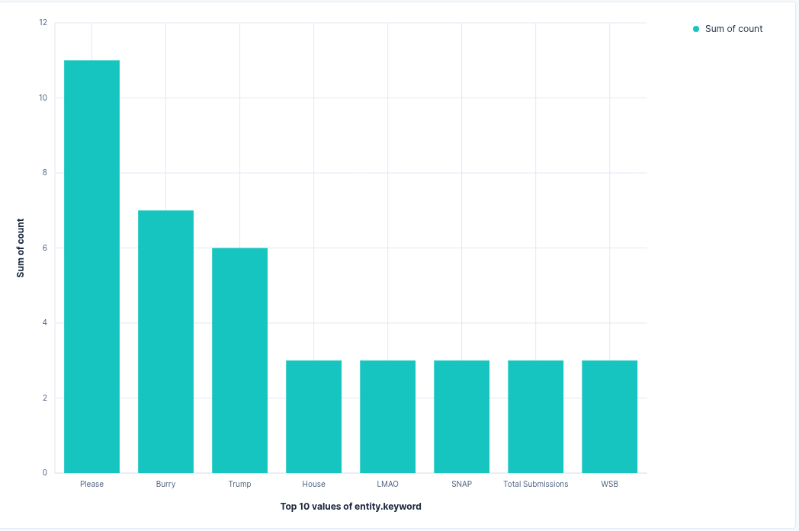

# Real-Time Named Entity Recognition (NER) on Reddit Comments using Kafka, Spark, and ELK

[](https://opensource.org/licenses/MIT)  

This project demonstrates a **real-time data streaming pipeline** that extracts **Named Entities (NER)** from live Reddit comments using **Kafka** and **PySpark**, and visualizes the top entities in **Kibana** through the **ELK stack**. The system streams comments from the `r/wallstreetbets` subreddit and processes them continuously.

---

## Project Structure

```
REAL-TIME-NER-REDDIT-STREAMING/
│
├── config/
│   └── reddit_pipeline.conf
│
├── src/
│   ├── reddit_consumer.py
│   ├── reddit_publisher.py
│   └── spark_processing.py
│
├── .env
└── .gitignore
```

---

## Project Objective

Implement a **Spark Streaming pipeline** that:
1. Streams live Reddit comments to Kafka.
2. Performs **Named Entity Recognition (NER)** in real time using **NLTK** and **PySpark**.
3. Sends the top entities per time window to another Kafka topic.
4. Visualizes entity frequency trends in **Kibana** through **ELK integration**.

---

## Data Flow

1. **Reddit → Kafka (`reddit-stream`)**
   - Reddit comments are published to the Kafka topic.
2. **Kafka → Spark Streaming**
   - PySpark reads live messages from `reddit-stream`.
3. **NER Extraction (NLTK)**
   - Named entities are identified and counted over a tumbling window.
4. **Kafka (`reddit-entities`)**
   - Top entities are pushed back to Kafka.
5. **Kafka → ELK**
   - Logstash consumes from `reddit-entities` and sends data to Elasticsearch.
6. **Kibana Visualization**
   - Displays top 10 entities at 5-minute intervals.

---

## Components

### 1. `reddit_publisher.py`
- Connects to Reddit’s `r/wallstreetbets` subreddit using the Reddit API.
- Publishes live comments to Kafka topic `reddit-stream`.


**Output Example:**
```
Comment no1ummi sent to Kafka
```

---

### 2. `reddit_consumer.py`
- Consumes and displays messages from Kafka topic `reddit-stream` to verify successful data flow.

**Output Example:**
```
Received message: Topic=reddit-stream, Offset=701, Value={'id': 'no1ss3h', 'body': 'Well we did dump...', 'created_utc': 1762745813.0}
```

---

### 3. `spark_processing.py`
- Subscribes to the Kafka topic `reddit-stream`.
- Extracts text data and performs NER using **NLTK** (`word_tokenize`, `pos_tag`, `ne_chunk`).
- Counts occurrences of each entity using **5-minute tumbling windows**.
- Publishes top 10 entities to Kafka topic `reddit-entities`.

**Output Example:**
```
[Batch 13] message: {'batch_id': 13, 'top_entities': [{'entity': 'Please', 'count': 11}, ...]}
[Batch 13] Sent top 10 entities to Kafka topic 'reddit-entities'
```

---

### 4. `reddit_pipeline.conf`
- Logstash configuration for reading from Kafka (`reddit-entities`) and indexing data in Elasticsearch.
- Used for Kibana visualization of real-time NER metrics.

---

## Running the Pipeline

### 1. Start Kafka Server
```bash
bin/kafka-server-start.sh config/server.properties
```

### 2. Create Kafka Topics
```bash
kafka-topics.sh --create --topic reddit-stream --bootstrap-server localhost:9092
kafka-topics.sh --create --topic reddit-entities --bootstrap-server localhost:9092
```

### 3. Run Reddit Publisher
```bash
python3 reddit_publisher.py
```

### 4. (Optional) Run Consumer for Verification
```bash
python3 reddit_consumer.py
```

### 5. Start Spark Streaming Job
```bash
spark-submit --packages org.apache.spark:spark-sql-kafka-0-10_2.12:3.5.6 src/spark_processing.py
```

### 6. Start ELK Stack
```bash
# Elasticsearch
bin/elasticsearch

# Logstash
logstash -f config/reddit_pipeline.conf

# Kibana
bin/kibana
```

### 7. Kibana Visualization
- Open: [http://localhost:5601]
- Create a **Lens** visualization:
  - **X-axis:** `entity.keyword`
  - **Y-axis:** `count (sum)`
  - **Display:** Top 10 entities per 5-minute interval

---

## Example Visualization

**Top Entities over Time (every 5 minutes):**

| **Interval** | **Top Entities (Examples)** |
|--------------:|-----------------------------|
| 5 min         | ACA, SNAP, Trump            |
| 10 min        | Trump, LMAO, Burry          |
| 15 min        | SNAP, House, WSB            |
| 20 min        | ACA, Burry, Trump           |
| 25 min        | SNAP, Trump, LMAO           |
| 30 min        | Please (11), Burry (7), Trump (6), SNAP (6) |

---

### 30-Minute Kibana Visualization

Below is the **Kibana bar plot** showing the **Top 10 Named Entities** after 30 minutes of real-time streaming:



> *Entities such as “Please”, “Burry”, “SNAP”, and “Trump” were consistently dominant during the 30-minute stream.*

---

## Technologies Used

- **Python**
- **Apache Kafka**
- **PySpark (Structured Streaming)**
- **NLTK (NER)**
- **Elasticsearch, Logstash, Kibana (ELK Stack)**

---


